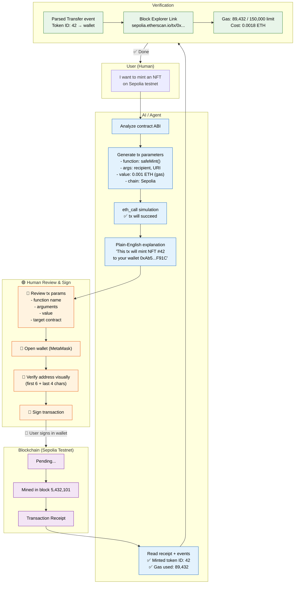

# Minimal AI × Web3 Workflow

> AI generates contract interaction → Human reviews → Wallet confirms → Testnet executes → Block explorer verifies

**Scenario:** A user wants to interact with a smart contract (e.g., mint an NFT, stake tokens, or call a write function) on a testnet, assisted by AI.

---

## Workflow Diagram



---

## Step-by-Step Breakdown

| Step | Who | What Happens | 🔴 Human Confirmation? |
|------|-----|--------------|------------------------|
| 1. Input | **User** | Says "I want to mint NFT on Sepolia" | Initiates task |
| 2. Analyze ABI | **AI** | Reads contract ABI, finds safeMint() function | No |
| 3. Generate params | **AI** | Builds tx params (function, args, value, chain) | No |
| 4. Simulate | **AI** | Runs `eth_call` → confirms tx will succeed | No |
| 5. Explain | **AI** | Writes plain-English description of the tx | No |
| 6. Review | **🔴 Human** | Reads AI's explanation, checks params | **Yes — verify everything** |
| 7. Open wallet | **🔴 Human** | Opens MetaMask / Rabby | **Yes — AI never accesses wallet** |
| 8. Verify address | **🔴 Human** | Visually matches contract address | **Yes — first 6 + last 4 chars** |
| 9. Sign | **🔴 Human** | Signs transaction in wallet | **Yes — AI never holds key** |
| 10. Execute | **Blockchain** | Tx mined on Sepolia | No |
| 11. Verify | **AI** | Reads receipt, parses events | No |
| 12. Report | **AI → User** | Shows result: token minted, gas cost, explorer link | User reads report |

---

## ASCII Diagram (for environments without Mermaid)

```
 User: "Mint NFT on Sepolia"
    │
    ▼
 ┌─────────────────────┐
 │ AI: Analyze ABI     │  ← AI only, no human needed
 │ AI: Generate params │
 │ AI: Simulate (eth_call)  │
 │ AI: Explain in English   │
 └─────────────────────┘
    │
    ▼
 ┌─────────────────────────────┐
 │ 🔴 Human: Review params    │  ← MUST be human
 │ 🔴 Human: Open wallet      │
 │ 🔴 Human: Verify address   │
 │ 🔴 Human: SIGN             │  ← KEYS NEVER LEAVE WALLET
 └─────────────────────────────┘
    │
    ▼
 ┌─────────────────────┐
 │ Blockchain: Mined   │  ← Automatic
 └─────────────────────┘
    │
    ▼
 ┌─────────────────────┐
 │ AI: Verify receipt  │  ← AI reads on-chain proof
 │ AI: Show result     │
 └─────────────────────┘
    │
    ▼
 User: ✅ Done
```

---

## Key Boundaries

| Layer | AI CAN | AI CANNOT |
|-------|--------|-----------|
| Contract analysis | Read ABI, explain functions | Modify contract state |
| Transaction building | Generate params, simulate | Send the transaction |
| Warnings | Detect dangerous functions | Block a transaction |
| Keys / Signing | Remind user to verify address | Touch private key, seed, or wallet |
| Verification | Read receipt, parse events | Reverse a completed tx |

---

## How to Verify Results

1. **Transaction Receipt** — AI reads `eth_getTransactionReceipt` and shows `status: 0x1` (success)
2. **Event Logs** — AI parses `Transfer` events: token ID, from, to
3. **Block Explorer** — AI provides a direct link: `https://sepolia.etherscan.io/tx/0x...`
4. **Gas Comparison** — AI compares estimated vs actual gas (if actual ≪ estimate, the tx was efficient; if actual ≈ gas limit, something may have gone wrong)
5. **State Check** — AI calls `balanceOf()` or `ownerOf()` to confirm the expected state change

---

## Risks

1. **Simulation ≠ Execution** — `eth_call` simulates against current chain state. Between simulation and execution, the state can change (MEV, frontrunning, other txs). The user's actual output may differ.

2. **AI Misread ABI** — AI may parse the wrong function signature or misinterpret parameters. If the AI says "this function transfers tokens" but it actually has side effects, the user might sign a malicious tx.

3. **Phishing Address** — If the user pastes a wrong contract address (or a phishing site provides one), AI's entire analysis is based on false premises. AI verifies checksum, but cannot detect social engineering.

4. **Testnet ≠ Mainnet** — A working testnet simulation does NOT guarantee the same behavior on mainnet. Contract bytecode, oracle prices, and liquidity profiles differ.

5. **Gas Estimation Failures** — AI's gas estimate via `eth_estimateGas` may be inaccurate for complex contract interactions (especially proxy patterns or multi-call transactions), causing the tx to fail or cost more than expected.

---

## 5-Sentence Summary

| # | Question | Answer |
|---|----------|--------|
| 1 | What problem does this solve? | Helps users safely interact with smart contracts by having AI handle all the research, parameter building, and post-tx verification, while the human retains full custody of keys and signing. |
| 2 | Which steps are AI-assisted? | AI reads the contract ABI, generates transaction parameters, simulates the call, writes a plain-English explanation, and verifies the receipt after execution. |
| 3 | Which steps must be human-confirmed? | Reviewing the AI's parameter explanation, opening the wallet, visually verifying the contract address, and signing the transaction. AI never touches keys or the wallet. |
| 4 | How to verify the result? | Read the transaction receipt (`status: 0x1`), parse Transfer events for the expected token, compare gas used vs estimate, and provide a block explorer link for independent verification. |
| 5 | What are the main risks? | Simulation ≠ execution (state can change between sim and real tx), AI misreading the ABI, phishing addresses bypassing AI analysis, testnet ≠ mainnet behavior, and inaccurate gas estimation for complex contracts. |