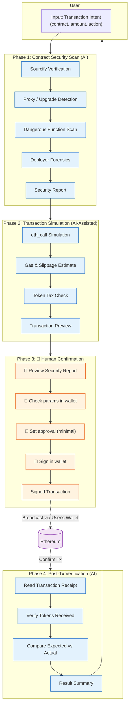

# SafeTx Oracle — Workflow

## Overview

```
User Input: "I want to swap 1 ETH for USDC on Uniswap V3, contract 0x88e6..."
         │
         ▼
┌─────────────────────────────────────────────────────┐
│  Phase 1: Contract Security Scan (AI, Automated)     │
│  ├── Sourcify verification check                     │
│  ├── Proxy / upgrade risk detection                  │
│  ├── Dangerous function signature scan               │
│  ├── Deployer wallet forensics                       │
│  └── Output: Security Report                         │
└─────────────────────────────────────────────────────┘
         │
         ▼
┌─────────────────────────────────────────────────────┐
│  Phase 2: Transaction Simulation (AI-Assisted)      │
│  ├── Simulate swap via eth_call                      │
│  ├── Estimate gas cost & slippage                    │
│  ├── Check token transfer tax / fee                  │
│  ├── Generate structured transaction description     │
│  └── Output: Transaction Preview                     │
└─────────────────────────────────────────────────────┘
         │
         ▼
┌─────────────────────────────────────────────────────┐
│  Phase 3: 🔴 Human Confirmation                     │
│  ├── 🔴 User reviews Security Report                 │
│  ├── 🔴 User checks transaction params in wallet     │
│  ├── 🔴 User sets approval amount (minimal)          │
│  ├── 🔴 User signs transaction in wallet             │
│  └── Output: Signed transaction broadcast to chain   │
└─────────────────────────────────────────────────────┘
         │
         ▼
┌─────────────────────────────────────────────────────┐
│  Phase 4: Post-Tx Verification (AI, Automated)      │
│  ├── Read transaction receipt                        │
│  ├── Verify actual tokens received                   │
│  ├── Compare expected vs actual outcome              │
│  └── Output: Result Summary                          │
└─────────────────────────────────────────────────────┘
```

## Mermaid Diagram



## Color Legend

| Color | Role |
|-------|------|
| 🔵 Blue | AI automated step |
| 🟠 Orange | 🔴 Human confirmation required |
| 🟣 Purple | Blockchain / network layer |

## Confirmation Points

| Step | AI Does | 🔴 Human Does |
|------|---------|---------------|
| Contract scan | Execute & interpret | Read report, decide to proceed |
| Transaction params | Suggest values | Enter into wallet |
| Token approval | Check requirement, suggest minimal | Confirm approval tx |
| Signing | Generate EIP-712 description | Sign in wallet |
| Address check | Verify checksum | Visually verify full address |
| Result check | Read receipt, compare | Review comparison |